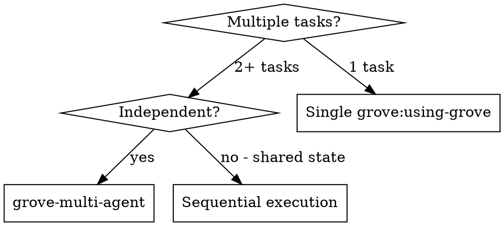

# Grove Skills Plugin Implementation Plan

> **For Claude:** REQUIRED SUB-SKILL: Use superpowers:executing-plans to implement this plan task-by-task.

**Goal:** Add a Claude Code plugin to the Grove repo with five skills, a SessionStart hook, and a slash command.

**Architecture:** Standalone Claude Marketplace plugin living alongside the Go CLI. Skills are Markdown files following superpowers conventions. A SessionStart hook detects Grove context and injects it into conversations. The plugin replaces superpowers' worktree skills when installed in a Grove project.

**Tech Stack:** Markdown (SKILL.md files), JSON (plugin config, hooks config), Bash (session-start hook)

**Design doc:** `docs/plans/2026-02-18-grove-skills-design.md`

---

### Task 1: Plugin scaffolding

Create the `.claude-plugin/` directory with plugin metadata.

**Files:**
- Create: `.claude-plugin/plugin.json`
- Create: `.claude-plugin/marketplace.json`

**Step 1: Create plugin.json**

Create `.claude-plugin/plugin.json`:

```json
{
  "name": "grove",
  "description": "Grove skills for Claude Code: instant isolated workspaces with warm build caches via copy-on-write clones",
  "version": "0.1.0",
  "author": {
    "name": "Chris Banes"
  },
  "homepage": "https://github.com/chrisbanes/grove",
  "repository": "https://github.com/chrisbanes/grove",
  "license": "Apache-2.0",
  "keywords": ["grove", "workspaces", "cow", "isolation", "multi-agent"]
}
```

**Step 2: Create marketplace.json**

Create `.claude-plugin/marketplace.json`:

```json
{
  "name": "grove",
  "description": "Grove skills for Claude Code: instant isolated workspaces with warm build caches",
  "owner": {
    "name": "Chris Banes"
  },
  "plugins": [
    {
      "name": "grove",
      "description": "Grove skills for Claude Code: instant isolated workspaces with warm build caches via copy-on-write clones",
      "version": "0.1.0",
      "source": "./",
      "author": {
        "name": "Chris Banes"
      }
    }
  ]
}
```

**Step 3: Commit**

```bash
git add .claude-plugin/
git commit -m "feat: add Claude Code plugin scaffolding"
```

---

### Task 2: SessionStart hook

Create the hook that detects Grove context and injects it into conversations.

**Files:**
- Create: `hooks/hooks.json`
- Create: `hooks/session-start.sh`

**Step 1: Create hooks.json**

Create `hooks/hooks.json`:

```json
{
  "hooks": {
    "SessionStart": [
      {
        "matcher": "startup|resume|clear|compact",
        "hooks": [
          {
            "type": "command",
            "command": "${CLAUDE_PLUGIN_ROOT}/hooks/session-start.sh",
            "async": false
          }
        ]
      }
    ]
  }
}
```

**Step 2: Create session-start.sh**

Create `hooks/session-start.sh`. The script must:

1. Check if `grove` CLI is on PATH
2. Walk up from `$PWD` looking for `.grove/workspace.json` (workspace) or `.grove/config.json` (golden copy)
3. Build a context message based on what it finds
4. Output JSON in the `hookSpecificOutput` format (see superpowers `hooks/session-start.sh` for the exact structure)

Detection priority:
- `.grove/workspace.json` found → in a workspace. Read the file to extract ID, golden copy path, branch.
- `.grove/config.json` found → in a golden copy.
- `grove` not on PATH → CLI not installed.
- None of the above → inject nothing (silent).

The output format (matching superpowers convention):

```bash
cat <<EOF
{
  "hookSpecificOutput": {
    "hookEventName": "SessionStart",
    "additionalContext": "<escaped context string>"
  }
}
EOF
```

The context string should reference the appropriate grove skills by name (`grove:using-grove`, `grove:finishing-grove-workspace`, `grove:grove-init`).

Make the script executable: `chmod +x hooks/session-start.sh`

**Step 3: Test the hook manually**

```bash
cd /path/to/a/grove/golden-copy && bash hooks/session-start.sh
cd /path/to/a/grove/workspace && bash hooks/session-start.sh
cd /tmp && bash hooks/session-start.sh
```

Verify each produces the correct JSON output (or empty for no Grove context).

**Step 4: Commit**

```bash
git add hooks/
git commit -m "feat: add SessionStart hook for Grove context detection"
```

---

### Task 3: `using-grove` skill

The core skill that replaces `superpowers:using-git-worktrees`.

**Files:**
- Create: `skills/using-grove/SKILL.md`

**Step 1: Write SKILL.md**

Create `skills/using-grove/SKILL.md`. Follow the superpowers SKILL.md conventions exactly:

- YAML frontmatter with `name` and `description` fields only
- `description` starts with "Use when..." and describes triggering conditions only (no workflow summary — see CSO rules in `writing-skills`)
- Announce at start pattern
- Workflow steps with bash commands
- Quick reference table
- Common mistakes section
- Red flags section
- Integration section listing what calls it and what it pairs with

Key content for the workflow:

1. **Verify grove initialized**: `test -d "$(git rev-parse --show-toplevel)/.grove"`. If not found, suggest `grove:grove-init`.
2. **Verify CLI installed**: `command -v grove`. If not found, provide install URL.
3. **Create workspace**: `grove create --branch <branch-name> --json`. Parse JSON for path and ID.
4. **cd into workspace**: `cd <workspace-path>`
5. **Verify baseline**: Run project test suite. Auto-detect from marker files (package.json → npm test, go.mod → go test ./..., etc.). If tests fail, report and ask.
6. **Report ready**: Workspace path, branch, build state (warm).

Integration section must state:
- **Replaces:** `superpowers:using-git-worktrees` — users should prefer this skill when in a Grove project
- **Called by:** brainstorming, subagent-driven-development, executing-plans
- **Pairs with:** `grove:finishing-grove-workspace`

**Step 2: Commit**

```bash
git add skills/using-grove/
git commit -m "feat: add using-grove skill"
```

---

### Task 4: `finishing-grove-workspace` skill

Replaces `superpowers:finishing-a-development-branch` for Grove workspaces.

**Files:**
- Create: `skills/finishing-grove-workspace/SKILL.md`

**Step 1: Write SKILL.md**

Follow the same conventions as Task 3.

Key content:

1. **Detect workspace**: `test -f "$(git rev-parse --show-toplevel)/.grove/workspace.json"`. If not in workspace, tell user to use `superpowers:finishing-a-development-branch` instead.
2. **Verify tests pass**: Auto-detect test command. If tests fail, stop.
3. **Read workspace metadata**: `cat .grove/workspace.json`. Extract ID, golden copy path, branch.
4. **Present 4 options** (exactly these, matching superpowers style):
   1. Push branch and create a Pull Request
   2. Push branch and destroy workspace
   3. Keep workspace as-is
   4. Discard work and destroy workspace
5. **Execute choice**: Each option runs the appropriate git/grove commands. Options 1, 2, 4 use `grove destroy <id>` and cd back to golden copy. Option 4 requires typed "discard" confirmation.

Integration:
- **Replaces:** `superpowers:finishing-a-development-branch` when in a Grove workspace
- **Called by:** subagent-driven-development, executing-plans
- **Pairs with:** `grove:using-grove`

**Step 2: Commit**

```bash
git add skills/finishing-grove-workspace/
git commit -m "feat: add finishing-grove-workspace skill"
```

---

### Task 5: `grove-init` skill and slash command

Setup skill with build system detection.

**Files:**
- Create: `skills/grove-init/SKILL.md`
- Create: `commands/grove-init.md`

**Step 1: Write SKILL.md**

Key content:

1. **Verify git repo**: `git rev-parse --show-toplevel`. If not a repo, stop.
2. **Check if already initialized**: `test -d .grove`. If yes, report and ask if they want to re-initialize.
3. **Detect build system** by scanning for marker files in priority order:
   - `build.gradle.kts` or `build.gradle` → Gradle (warmup: `./gradlew assemble`, post-clone: clean lock files + configuration-cache)
   - `package.json` → Node.js (warmup: `npm run build`, post-clone: clean node_modules/.cache)
   - `Cargo.toml` → Rust (warmup: `cargo build`, post-clone: clean incremental build artifacts)
   - `go.mod` → Go (warmup: `go build ./...`, post-clone: minimal cleanup needed)
   - `pyproject.toml` or `requirements.txt` → Python (warmup: `pip install -e .` or `poetry install`, post-clone: clean `__pycache__`)
   - `Makefile` or `CMakeLists.txt` → C/C++ (warmup: `make` or `cmake --build build`, post-clone: project-specific)
   - Multiple matches → ask user which is primary
   - None found → ask user for warmup command
4. **Present proposed config** for confirmation: warmup command, workspace directory, post-clone hook content.
5. **Run grove init** with chosen warmup command.
6. **Write post-clone hook** to `.grove/hooks/post-clone`, make executable.
7. **Suggest git add** for `.grove/config.json` and `.grove/hooks/`.

**Step 2: Write slash command**

Create `commands/grove-init.md`:

```markdown
---
description: "Set up Grove for this project - detects build system, configures golden copy"
disable-model-invocation: true
---

Invoke the grove:grove-init skill and follow it exactly as presented to you
```

**Step 3: Commit**

```bash
git add skills/grove-init/ commands/
git commit -m "feat: add grove-init skill and /grove-init command"
```

---

### Task 6: `grove-doctor` skill

Diagnostic skill for troubleshooting Grove setup issues.

**Files:**
- Create: `skills/grove-doctor/SKILL.md`

**Step 1: Write SKILL.md**

Key content — run these checks in order, report pass/fail/warn for each:

1. **Platform**: Check macOS with APFS (`diskutil info / | grep "File System"`)
2. **CLI installed**: `command -v grove`
3. **CLI version**: `grove version`
4. **Grove initialized**: `.grove/config.json` exists
5. **Golden copy health**: Is git repo clean? (`grove status` or `git status --porcelain`). Report branch, commit, dirty state.
6. **Workspace directory**: Configured dir exists, is writable, has disk space (`df -h`)
7. **Hooks**: `.grove/hooks/post-clone` exists and is executable (`test -x`)
8. **Active workspaces**: `grove list --json`. Report count, flag any with stale branches.

Output format — a checklist:
```
Grove Doctor Report:
  [PASS] Platform: macOS (APFS)
  [PASS] CLI: grove v0.1.0
  [PASS] Initialized: .grove/config.json found
  [WARN] Golden copy: 3 uncommitted changes
  [PASS] Workspace dir: /tmp/grove/myproject (12GB free)
  [FAIL] Hooks: .grove/hooks/post-clone not executable
         Fix: chmod +x .grove/hooks/post-clone
  [PASS] Workspaces: 2 active
```

For each failure, provide a specific fix command or suggestion.

**Step 2: Commit**

```bash
git add skills/grove-doctor/
git commit -m "feat: add grove-doctor skill"
```

---

### Task 7: `grove-multi-agent` skill

Parallel workspace orchestration skill.

**Files:**
- Create: `skills/grove-multi-agent/SKILL.md`

**Step 1: Write SKILL.md**

This is the most complex skill. Key content:

**When to use flowchart** (non-obvious decision):


**Workflow:**

1. **Receive tasks**: Accept a list of independent tasks (from a plan, from user, from dispatching-parallel-agents).
2. **Validate independence**: Check tasks don't reference overlapping files. If overlap detected, warn and ask whether to proceed.
3. **Determine branch prefix**: Use current branch or ask user. Workspace branches will be `agent/<prefix>/<task-slug>`.
4. **Create N workspaces**: For each task, run `grove create --branch agent/<prefix>/<task-slug> --json`. Collect paths and IDs.
5. **Dispatch N subagents**: One `Task` tool call per workspace, all in parallel. Each subagent prompt includes:
   - Full task description
   - Instruction to `cd` into its workspace path
   - Instruction to implement, write tests, verify tests pass, commit
   - Instruction to return a summary of changes made
6. **Collect results**: As subagents return, gather summaries.
7. **Review for conflicts**: Check if any agents edited overlapping files across workspaces (shouldn't happen if truly independent).
8. **Report results**: Summary of what each agent accomplished, any failures.
9. **Present cleanup options**:
   - Push all branches and create PRs
   - Keep all workspaces for manual review
   - Destroy all workspaces
   - Handle individually

**Integration:**
- Uses `grove create` and `grove destroy` CLI commands
- Complements `superpowers:dispatching-parallel-agents` (same pattern but with isolated workspaces)
- Each subagent should follow `superpowers:test-driven-development`

**Step 2: Commit**

```bash
git add skills/grove-multi-agent/
git commit -m "feat: add grove-multi-agent skill"
```

---

### Task 8: Final review and integration commit

Verify the full plugin structure is correct and everything works together.

**Step 1: Verify directory structure**

```bash
find .claude-plugin skills hooks commands -type f | sort
```

Expected:
```
.claude-plugin/marketplace.json
.claude-plugin/plugin.json
commands/grove-init.md
hooks/hooks.json
hooks/session-start.sh
skills/finishing-grove-workspace/SKILL.md
skills/grove-doctor/SKILL.md
skills/grove-init/SKILL.md
skills/grove-multi-agent/SKILL.md
skills/using-grove/SKILL.md
```

**Step 2: Verify session-start.sh is executable**

```bash
ls -la hooks/session-start.sh
```

**Step 3: Verify all SKILL.md files have valid frontmatter**

Check each SKILL.md starts with `---`, has `name` and `description` fields, and the description starts with "Use when".

**Step 4: Run session-start.sh in various contexts**

Test that the hook outputs valid JSON or nothing, depending on context.

**Step 5: Commit any fixes**

```bash
git add -A
git commit -m "fix: address integration issues from final review"
```

(Only if there are fixes needed.)
