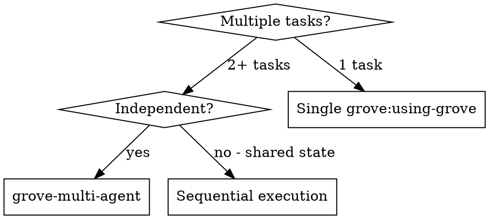

I'm using the grove-multi-agent skill to orchestrate parallel agents across isolated Grove workspaces.

## When to Use This Skill



Use `grove-multi-agent` only when tasks are truly independent: no shared file modifications, no ordering dependencies between them.

## Workflow

### Step 1: Receive tasks

Accept a list of independent tasks. Tasks may come from a decomposed plan, directly from the user, or from a dispatching agent (e.g., `superpowers:dispatching-parallel-agents`). Each task must be a self-contained unit of work.

### Step 2: Validate independence

Before creating any workspaces, review the task list for overlapping file scope. If two tasks would modify the same file or directory, they are not truly independent.

- If overlap is detected: warn the user, identify the conflicting tasks, and ask whether to proceed (by serializing those tasks) or restructure the plan.
- If no overlap: continue.

### Step 3: Determine branch prefix

Use the current branch name as the prefix, or ask the user for one. Workspace branches will follow the pattern:

```
agent/<prefix>/<task-slug>
```

Example: if the prefix is `feature/auth-overhaul` and the task is "Add OAuth login", the branch becomes `agent/feature-auth-overhaul/add-oauth-login`.

### Step 4: Create N workspaces

For each task, run:

```bash
grove create --branch agent/<prefix>/<task-slug> --json
```

Collect the `path` and `id` from each JSON response:

```json
{
  "id": "abc1",
  "path": "/tmp/grove/myapp/abc1",
  "branch": "agent/<prefix>/<task-slug>",
  "created_at": "2026-02-17T10:20:00Z",
  "golden_copy": "/Users/chris/dev/myapp"
}
```

Store a mapping of task -> workspace path and workspace ID for later use.

### Step 5: Dispatch N subagents

Issue one `Task` tool call per workspace, all in parallel (not sequentially). Use the subagent prompt template below.

**Subagent prompt template:**

```
Task tool (general-purpose):
  description: "Task N: <task-name>"
  prompt: |
    You are working in a Grove workspace at <workspace-path>.

    cd <workspace-path>

    Your task: <full task description>

    Instructions:
    1. Implement the task
    2. Write tests
    3. Verify tests pass
    4. Commit your work
    5. Report back: what you changed, test results, any concerns
```

Each subagent operates in isolation. It cannot see or affect other workspaces.

### Step 6: Collect results

Wait for all subagents to return. Gather each agent's summary: files changed, test results, and any concerns raised.

### Step 7: Review for conflicts

Even if tasks were validated as independent in Step 2, verify that agents did not unexpectedly edit overlapping files (e.g., due to generated files, lock file updates, or auto-formatters touching shared files).

Compare the changed file lists across workspaces. If conflicts are found, flag them before proceeding to cleanup.

### Step 8: Report results

Present a summary of what each agent accomplished:

- Task name and workspace branch
- Files changed
- Test outcome (pass / fail / skipped)
- Any concerns the subagent raised

Flag any failures clearly so the user can decide how to handle them.

### Step 9: Present cleanup options

Present these options for the set of workspaces as a whole, plus individual handling if needed:

1. Push all branches and create PRs
2. Keep all workspaces for manual review
3. Destroy all workspaces
4. Handle individually (step through each workspace one at a time using `grove:finishing-grove-workspace`)

For option 1, derive each PR title from the branch name and body from commit summaries since the golden copy:

```bash
git push -u origin <branch>
gh pr create --title "<title>" --body "<body>"
grove destroy <workspace-id>
```

## Quick Reference

| Command | Purpose |
|---|---|
| `grove create --branch <name> --json` | Create a workspace, capture path and ID |
| `grove list` | List all active workspaces |
| `grove destroy <id>` | Remove a workspace |
| `gh pr create --title "<t>" --body "<b>"` | Open a PR from a pushed branch |

## Common Mistakes

- **Dispatching agents that need to modify shared files** — if two tasks touch the same file, they will produce conflicting commits that cannot be cleanly merged. Validate independence first.
- **Not validating task independence before dispatch** — skipping Step 2 means conflicts surface after agents have done work, wasting compute and time.
- **Forgetting to collect and review results from all agents before cleanup** — destroying workspaces before reviewing agent output means losing work. Always complete Steps 6-8 before any cleanup.
- **Creating workspaces sequentially instead of dispatching agents in parallel** — the workspaces must all exist before dispatching; but subagent Task calls should all be issued in one parallel batch, not one at a time.
- **Using this skill for dependent tasks** — if Task B needs output from Task A, use sequential execution with `grove:using-grove` instead.

## Red Flags

- **Agents reporting conflicting changes to the same file** — the task decomposition was not truly independent. Pause cleanup, review the conflicts manually, and resolve before pushing.
- **Multiple agents failing with similar errors** — this may indicate a systemic issue with the golden copy (stale build state, broken tests at baseline). Run `grove update` on the golden copy and retry.
- **Running out of workspace slots** — Grove enforces a `max_workspaces` limit from `.grove/config.json`. If the limit is hit, create and dispatch agents in batches, or increase the limit with `grove init`.
- **Subagent returns without committing** — the agent may have encountered test failures or blocking issues. Check the agent's concern report before treating the workspace as complete.

## Key Difference from dispatching-parallel-agents

`superpowers:dispatching-parallel-agents` runs agents in parallel but they share the same working directory. `grove-multi-agent` gives each agent its own isolated workspace with warm build state — agents can build, modify files, and run tests without interfering with each other. Use this skill when agents need build isolation, not just logical separation.

## Integration

- **Uses:** `grove create` and `grove destroy` CLI commands
- **Requires:** Grove initialized in the repo (`grove:grove-init`) and CLI available (`grove:grove-doctor`)
- **Complements:** `superpowers:dispatching-parallel-agents` — same parallel dispatch pattern, but with isolated workspaces instead of a shared directory
- **Each subagent should follow:** `superpowers:test-driven-development`
- **Cleanup follows:** `grove:finishing-grove-workspace` for individual workspace resolution
